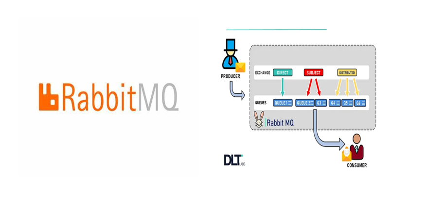
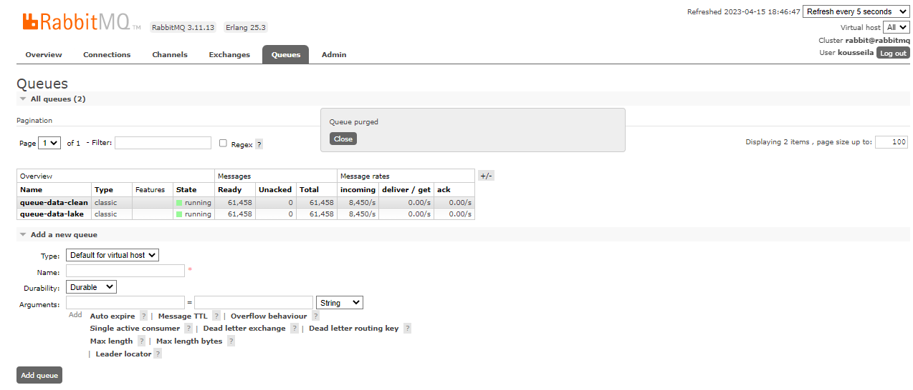
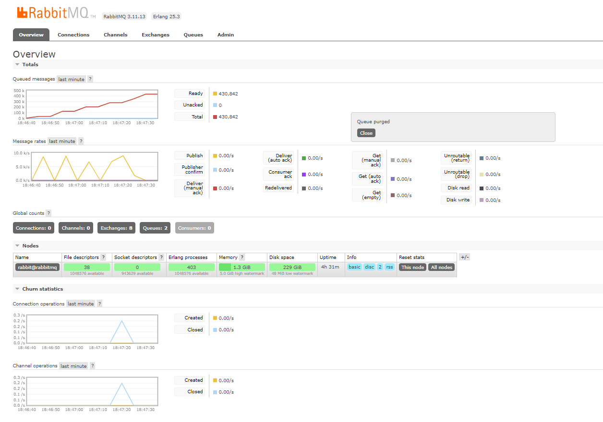
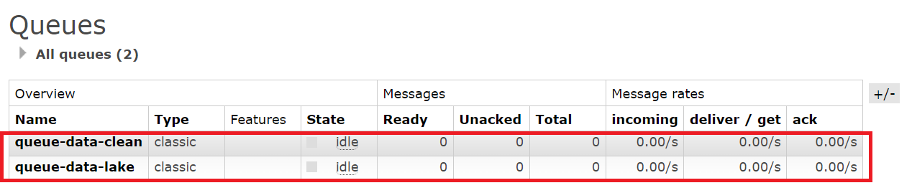
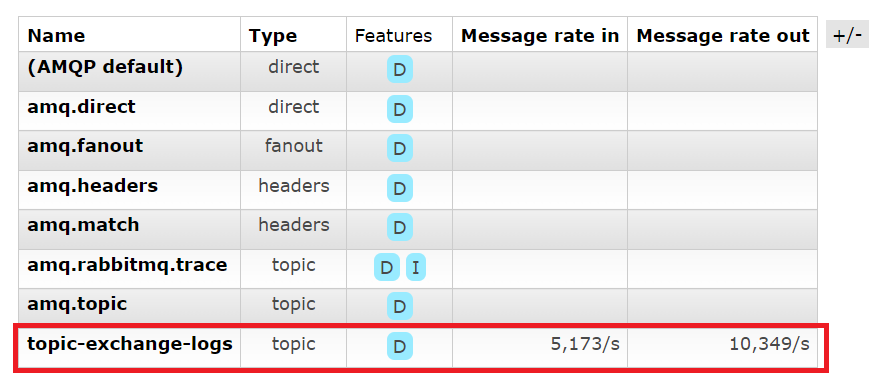
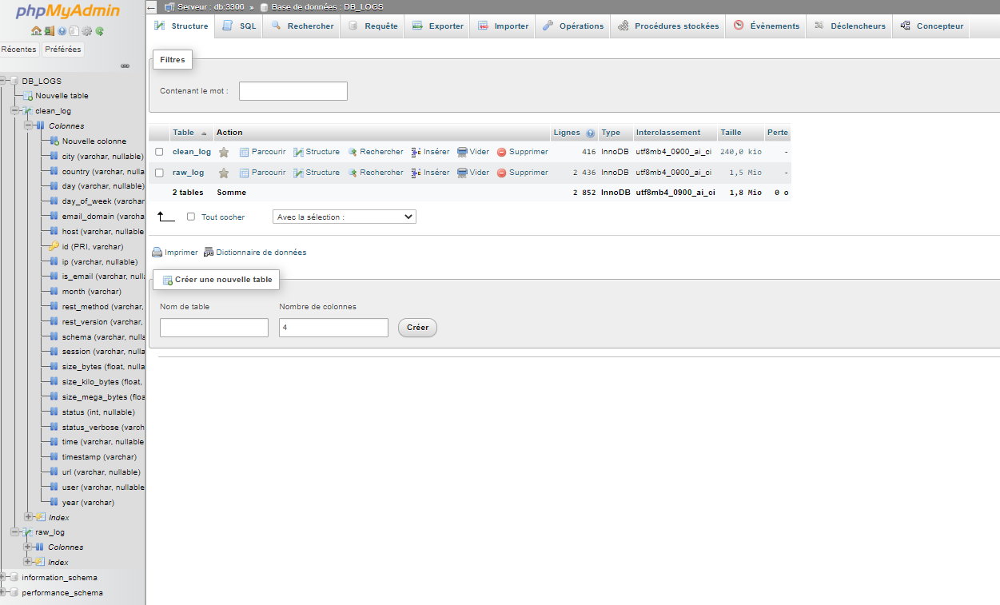
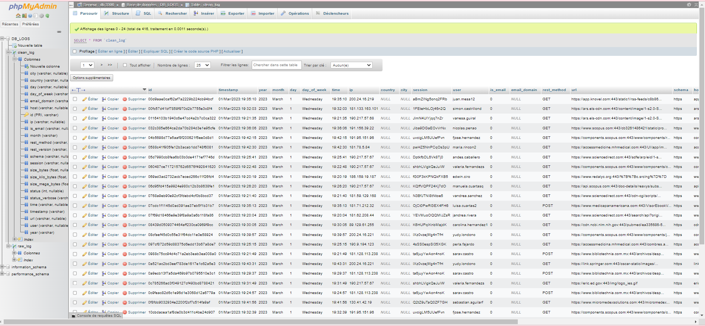

# Data-Streaming-RabbitMQ
# introduction: 
Les données en streaming sont des données générées en continu par différentes sources. De telles données doivent être traitées de manière incrémentale en utilisant des techniques de traitement en continu sans avoir accès à l'ensemble des données. De plus, il est important de prendre en compte la possibilité de changements dans les propriétés de ces données au fil du temps, également appelée dérive conceptuelle.

Ces données sont souvent associées au concept de big data, car elles sont générées par de nombreuses sources différentes à grande vitesse. Le streaming de données peut également être expliqué comme une technologie utilisée pour fournir du contenu à des appareils via Internet, ce qui permet aux utilisateurs d'y accéder immédiatement, sans avoir à attendre qu'il soit téléchargé.

Le stockage étant un enjeu majeur pour les organisations traitant de grandes quantités de données, les concepts de "data lake" et de "data stream" ont vu le jour. Un "data lake" correspond au stockage de grandes quantités de données structurées et semi-structurées, et est utile pour le traitement du big data, car il permet de plonger dans le lac de données et de récupérer ce dont on a besoin au moment où on en a besoin. En revanche, le "data stream" permet d'effectuer une analyse en temps réel des données en streaming, sans avoir à les stocker au préalable. Cette approche se distingue du "data lake" par sa vitesse d'analyse et sa nature continue, ce qui la rend idéale pour le traitement de grandes quantités de données en continu.

# RabbitMQ:
RabbitMQ est l'un des courtiers de messages open-source les plus populaires, utilisé par des dizaines de milliers d'utilisateurs dans le monde entier, des petites start-ups aux grandes entreprises telles que T-Mobile et Runtastic.

RabbitMQ est facile à déployer sur site ou dans le cloud, et est léger. Il prend en charge plusieurs protocoles de messagerie et peut être déployé dans des configurations distribuées et fédérées pour répondre aux exigences de haute disponibilité et de grande échelle.

Il fonctionne sur de nombreux systèmes d'exploitation et environnements de cloud, et offre une large gamme d'outils pour les développeurs dans la plupart des langages de programmation populaires.

Pour en savoir plus sur RabbitMQ, vous pouvez consulter leur site web à l'adresse suivante: https://www.rabbitmq.com/

<p align="center">
  
</p>

# Le Projet:
Notre projet consiste à créer un producteur qui lit un fichier journal (logs) et publie les données sur deux files d'attente, queue-data-lake et queue-data-clean. Les deux files d'attente utilisent la même clé de routage, "logs", ce qui signifie que chaque événement publié par le producteur sera envoyé aux deux files d'attente. Deux consommateurs seront créés pour consommer les événements de chaque file d'attente, transformer les données et les insérer dans une base de données à l'aide d'un ORM.

Voici quelques suggestions pour améliorer notre réalisation :

Définir l'objectif du projet: Avant de commencer à développer le projet, il est important de définir clairement l'objectif et les cas d'utilisation. Par exemple, l'objectif peut être de collecter et de stocker des données de journalisation pour l'analyse ou pour surveiller la santé d'une application. Les cas d'utilisation peuvent inclure la détection des erreurs, le suivi des performances, la sécurité ou la conformité.

Choisir la technologie appropriée : Il est important de choisir les technologies appropriées pour le projet, en fonction des besoins de l'objectif. Par exemple, pour la collecte et la diffusion de données de journalisation, il peut être judicieux d'utiliser des technologies de file d'attente comme Apache Kafka ou RabbitMQ. Pour stocker les données dans une base de données, vous pouvez utiliser un ORM (Object Relational Mapping) comme SQLAlchemy ou Hibernate.

Définir les formats de données : Il est important de définir les formats de données pour les fichiers journaux et pour les messages échangés entre les producteurs et les consommateurs. Les formats de données doivent être normalisés et cohérents pour faciliter la transformation et le stockage des données.

Définir les stratégies de traitement des erreurs : Il est important de définir les stratégies de traitement des erreurs pour gérer les échecs de traitement des messages, les pannes des consommateurs ou des producteurs, et les conflits de données. Les stratégies peuvent inclure la gestion des redémarrages automatiques, la journalisation des erreurs, la mise en place de mécanismes de sauvegarde et de restauration, et la gestion des conflits de données.

Sécurité : La sécurité doit être prise en compte dès le début du projet, et les bonnes pratiques doivent être appliquées pour garantir la confidentialité, l'intégrité et la disponibilité des données. Il est important de définir les politiques de sécurité, d'authentification et de contrôle d'accès appropriées pour le projet.

En résumé, pour améliorer votre idée de projet, il est important de définir clairement l'objectif et les cas d'utilisation, de choisir les technologies appropriées, de définir les formats de données et les stratégies de traitement des erreurs, et de prendre en compte les aspects de sécurité.

<p align="center">
  
</p>

# data-lake-consumer:

Le data-lake-consumer se connectera à une base de données MySQL et insérera chaque ligne de journalisation comme un nouveau enregistrement dans une table appelée raw-log en utilisant un ORM. Les informations seront stockées avec les détails suivants :

-id : hachage md5 de toute la ligne de journalisation ;
-timestamp : l'heure de la journalisation avec le fuseau horaire ;
-log : toute la ligne de journalisation.

Le data-lake-consumer permettra donc de stocker les informations de journalisation collectées dans la base de données MySQL, en les organisant dans la table raw-log pour faciliter leur gestion et leur utilisation ultérieure. Les données seront stockées avec une clé unique (id) pour garantir leur unicité, et avec un horodatage pour suivre l'évolution de la journalisation dans le temps.

Cela permettra aux utilisateurs du système de consulter facilement les données de journalisation, de les analyser et de les utiliser pour surveiller les performances, détecter les erreurs et améliorer la qualité de l'application.

# data-clean-consumer:

Le data-clean-consumer sera responsable de la transformation des données de journalisation collectées dans la file d'attente queue-data-clean. Il se connectera à la base de données MySQL et insérera chaque ligne de journalisation transformée comme un nouveau enregistrement dans une table appelée clean-log en utilisant un ORM.


# Implémentation  du projet

j'ai créé un seul fichier **consumer.py** ,dans ce fichier  qui sert à consommer des messages à partir de deux files d'attente RabbitMQ: **queue-data-lake** et **queue-data-clean**.

Le consumer utilise une instance **BlockingChannel** pour se connecter à RabbitMQ et utilise l'échange **topic-exchange-logs** pour s'abonner aux messages publiés avec les clés de routage **"logs"**.

Le code utilise également SQLAlchemy pour interagir avec une base de données MySQL. Il définit des modèles de données pour les logs bruts et les logs nettoyés. Il crée ensuite une instance de session à l'aide de **sessionmaker()** pour se connecter à la base de données.

La fonction **process_msg_lake**  (c'est le data-lake-consumer )est appelée lorsqu'un message est publié sur la file d'attente **queue-data-lake**. Elle consomme le message et insère un enregistrement dans la table raw_log.

La fonction **process_msg_clean**  (c'est le data-clean-consumer)est appelée lorsqu'un message est publié sur la file d'attente **queue-data-clean**. Elle consomme le message, effectue des transformations sur les données à l'aide de différentes classes de transformation telles que **UserTransformation** et **UrlTransformation**, et insère un enregistrement nettoyé dans la t**able clean_log**.

Le code est configuré pour exécuter les deux fonctions de consommation indéfiniment en utilisant **channel.start_consuming()**.

<p align="center">
  
</p>

## topic-producer.py

Le fichier **"topic-producer.py"** est un script Python qui crée des files d'attente **(queues)**et des échanges **(exchanges)** en utilisant la bibliothèque **pika**. Il lit un fichier de logs web (**"web-server-nginx.log"**) et publie chaque ligne de log dans l'échange "**topic-exchange-logs**" avec la clé de routage **"logs"**. Les logs sont ensuite transmis aux files d'attente **"queue-data-lake"** et **"queue-data-clean"** pour être nettoyés et stockés.

Le script contient également une liste d'événements, qui sont également publiés dans l'échange "topic-exchange-logs". Enfin, il initialise un fichier CSV ("parsed_data.csv") qui contiendra les données nettoyées.

## log_clean.py
Le fichier **"log_clean.py"** contient une classe **"Log_clean"**qui a plusieurs méthodes pour nettoyer et analyser des logs web.

La classe a plusieurs attributs tels que **"ip"**, **"user"**, **"domain"**, **"status"**, **"timestamp"**, **"method"**, **"schema"**, **"host"**, **"size"**, **"url"**, **"year"**, "month", **"day"**,**"day_of_week"**, **"time"**, **"country"**, **"city"**, **"session"** et **"rest_vers"**.

Les méthodes de la classe comprennent:

-**init** : Constructeur qui initialise toutes les variables de la classe à None.

-**parse** : Cette méthode prend une ligne de log en entrée et extrait les informations importantes telles que l'adresse IP, le nom d'utilisateur, le statut de la requête, 

-le **timestamp**, la méthode HTTP, la taille de la réponse et l'URL de la requête.

-**MD5** : Cette méthode prend une chaîne de caractères en entrée et calcule son hash MD5.

**get_location** : Cette méthode prend une adresse IP en entrée et utilise l'API "ipapi.co" pour récupérer des informations sur la localisation de cette adresse IP tels que le pays et la ville.

-**TimeStamp** : Cette méthode extrait le timestamp à partir d'une ligne de log.

-**rest_version** : Cette méthode extrait la version de HTTP à partir d'une ligne de log.

-**str**: Cette méthode renvoie une chaîne de caractères contenant toutes les informations extraites par les autres méthodes.

En résumé, ce fichier contient une classe pour nettoyer et analyser des logs web. La classe a plusieurs méthodes pour extraire les informations importantes à partir de chaque ligne de log, telles que l'adresse IP, le timestamp, la méthode HTTP, la taille de la réponse et l'URL de la requête.

## row_log.py

Le **row_log.py**fichier contient la **Log_lakeclasse** utilisée pour créer un objet qui représente une entrée de journal dans un fichier journal.

La classe a trois attributs : **id**, **timestampet** **log**.

La **MD5** méthode prend une entrée de journal sous forme de chaîne, la convertit en sa valeur de hachage MD5 et stocke la valeur de hachage dans l' idattribut.

La **TimeStamp** méthode prend une entrée de journal sous forme de chaîne, extrait l'horodatage de l'entrée de journal à l'aide d'expressions régulières et stocke l'horodatage dans l' timestampattribut.

La **line** méthode prend une entrée de journal sous forme de chaîne, supprime tous les guillemets doubles dans l'entrée de journal et supprime la dernière partie de l'entrée de journal, qui représente la taille de l'entrée de journal. Le message de journal résultant est stocké dans l' logattribut.

**La __str__méthode** renvoie une représentation sous forme de chaîne de l'objet, y compris les attributs id, timestampet .log

 ## transformation.py

Ce fichier **transformation.py** contient un module Python qui définit les classes pour la transformation des données de journal. Il importe plusieurs modules Python, notamment re, urllib.parse, abc, datetime, socket, requests, geoip2.databaseet http.

Le module définit cinq classes, chacune implémentant une opération de transformation pour un aspect spécifique des données de journal. Chaque classe hérite d'une classe de base abstraite appelée **BaseTransformationet** implémente sa transform méthode, qui accepte un seul argument logde type **Log_cleanet** renvoie une instance de **Log_cleanaprès** avoir appliqué une transformation spécifique aux données.

Les cinq classes sont :

**UserTransformation**: Cette classe implémente la transformation des données utilisateur dans un journal. Il vérifie si les données utilisateur sont une adresse e-mail et, si c'est le cas, extrait le nom de domaine et les ensembles is_emailet domainattributs de l' **Log_cleaninstance**.

**UrlTransformation**: Cette classe implémente la transformation des données d'URL dans un journal. Il extrait le schéma et l'hôte d'une chaîne d'URL et définit les attributs schemaet hostde l' Log_cleaninstance.

**IPTransformation**: Cette classe implémente la transformation des données d'adresse IP dans un journal. Il est censé extraire le pays et la ville de l'adresse IP d'une géo-base de données, mais l'implémentation est commentée.

**TimeTransformation**: Cette classe implémente la transformation des données d'horodatage dans un journal. Il analyse la chaîne d'horodatage dans le journal et la convertit en heure UTC, définit les attributs timestamp, year, day, day_of_week, monthet timede l' Log_cleaninstance.

**StatusCodeTransformation**: Cette classe implémente la transformation des données de code d'état dans un journal. Il convertit le code d'état en une chaîne lisible par l'homme à l'aide du httpmodule et définit l' status_verboseattribut de l' Log_cleaninstance. Si le code d'état n'est pas valide, il est défini status_verbosesur "Etat invalide".

**sizeTransformation**: Cette classe implémente la transformation des données de taille dans un journal. Il convertit la taille d'octets en kilo-octets et mégaoctets et définit les attributs size_k_bet size_m_bde l' Log_cleaninstance.


# Pratique : installation & execution 

Clonez le projet en utilisant la commande suivante :
```
git clone https://github.com/Kousseila69/Data-streaming-RabbitMQ.git

```
En suite  il faut créer un fichier **.env** ou bien modéfié le contenu de fichier existant avec les valeurs  suivantes :

*   Le nom d'utilisateur et le mot de passe administrateur de votre serveur RabbitMQ ;

*   Le nom d'utilisateur et le mot de passe de votre serveur MySQL ;

*   Le mot de passe root de votre serveur MySQL ;

*   Le nom de la base de données qui hébergera les événements consommés.

## docker-compose

Pour créer une instance RabbitMQ et une instance de serveur MySQL en utilisant docker-compose et le fichier .env, exécutez la commande suivante :

```
docker-compose --env-file .env -f docker-compose.yml -p data-stream up -d

```

Cela va créer :

Un serveur de flux de données et un serveur Web pour gérer RabbitMQ exposé sur le port 15672 (http://localhost:15672/);
Un serveur de base de données MySql et un serveur phpMyAdmin pour interagir avec la base de données (http://localhost:8080/).
Pour se connecter à la base de données où les journaux seront stockés à l'aide de phpMyAdmin et à RabbitMQ en utilisant le serveur de flux de données, utilisez les identifiants du fichier .env.

## Environnement virtuel Python

Execute cette commande:

```

python -m venv venv
.\venv\Scripts\activate
pip install -r requirements.txt

```

Ces commandes permettent de créer un environnement virtuel Python avec la commande python **-m venv venv**, d'activer l'environnement virtuel avec la commande **.\venv\Scripts\activate**, puis d'installer toutes les dépendances listées dans le fichier **requirements.txt** avec la commande**pip install -r requirements.txt**.

L'utilisation d'un environnement virtuel Python est une bonne pratique pour isoler les dépendances d'un projet et éviter les conflits avec d'autres projets ou le système global de Python. La commande **pip install -r requirements.txt** permet d'installer toutes les dépendances nécessaires pour exécuter le projet.

## Execution  -envoyer des messages dans la file d'attente RabbitMQ

Une fois l'envenvironnement virtuel Python activé , exécutez le script topic-producer.py en utilisant la commande:

```

python topic_producer.py

```

Cela enverra un certain nombre de messages dans la file d'attente spécifiée


<p align="center">
  
</p>

<p align="center">
  
</p>

## Execution  - à consommer des messages à partir de deux files d'attente RabbitMQ

Exécutez la commande suivante:

```
python consumer.py

```
Cela permettra de :

Créer la connexion au serveur ;
Créer l'échange (**topic-exchange-logs**) de type **"topic"** ;
Créer la file d'attente queue-data-clean et queue-data-lake ;
Créer le consommateur d'événements pour les deux files d'attente ;
Lancer le consommateur qui attendra l'arrivée des événements dans les deux files d'attente pour commencer à les consommer.


<p align="center">
  
</p>

<p align="center">
  
</p>

 # Création  de la base de données  DB_LOGS  des tables  raw-log et clean_log

 Le fichier **models.py** contient les définitions de deux classes de modèles SQLAlchemy : **clean_log**et **raw_log**.

La classe **clean_log** définit la structure de la table de base de données qui stockera les logs nettoyés. Chaque colonne correspond à un attribut des logs nettoyés qui seront extraits, transformés et chargés dans la base de données.

La classe **raw_log** définit la structure de la table de base de données qui stockera les logs bruts. Elle ne contient qu'une seule colonne pour le contenu du log brut et un identifiant unique pour chaque ligne.

Les deux classes héritent de la classe SQLAlchemy Base, qui fournit les attributs de base de la définition de modèle SQLAlchemy.

<p align="center">
  
</p>

## Table des logs clean_log

<p align="center">
  
</p>


## Table des logs row_log

<p align="center">
  
</p>